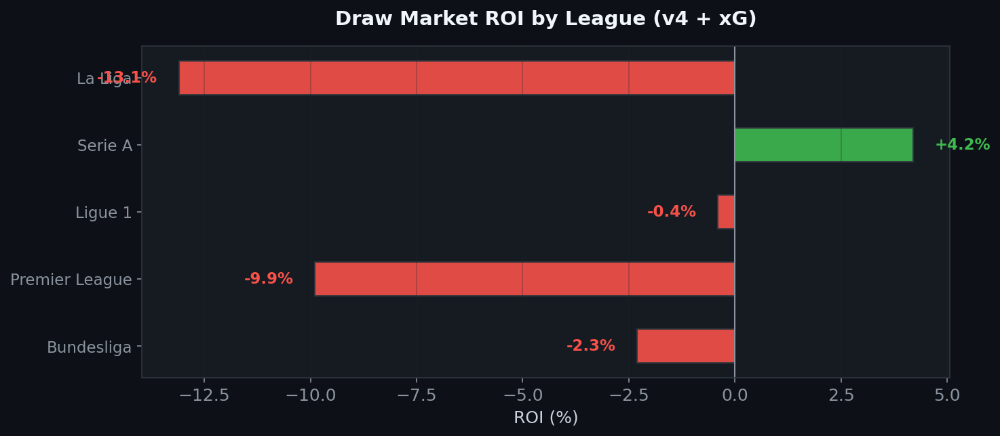

#  Value Bet Model — Can ML Beat the Bookmakers?

A rigorous, iterative machine learning investigation into whether publicly available data can generate profitable betting signals on European football markets.

**Short answer: no.** After 4 model iterations, 3 feature enrichment strategies, and 25 seasons of out-of-sample testing across 10 leagues, the bookmaker closing line remains unbeatable with public data. This repository documents the complete scientific process — from false positive to confirmed null result.

---

## The Approach

Each version adds new information to the model while keeping the same rigorous walk-forward validation:

| Version | What changed | Features | Market |
|---------|-------------|----------|--------|
| **v1** | Baseline — XGBoost + isotonic calibration | 56 rolling stats | Under 2.5 (Div2) |
| **v2** | Fixed calibration (Platt), reduced features | 21 lean features | Under 2.5 (Div2) |
| **v3** | Added inter-bookmaker disagreement signals | 25 features | Under 2.5 (Div2) |
| **v4** | Added expected goals from Understat | 28 features | Draw (Div1) |

---

## Result 1 — The AUC ceiling

The model's ability to discriminate between outcomes barely improves across iterations, and never reaches the profitable threshold (~0.58 AUC).


With an AUC stuck around 0.535–0.554, the model cannot generate enough *separation* between value bets and non-value bets to overcome the 5–8% bookmaker margin. Adding market features (v3) gave the best improvement (+0.02), but xG (v4) added nothing — the information was already captured by goals scored/conceded.

---

## Result 2 — Consistently negative ROI

Every version loses money. The trend improves slightly, but never crosses zero.


The improvement from v1 (−7.9%) to v4 (−4.5%) is mostly due to better calibration reducing the number of false value bets, not because the model found a real edge.

---

## Result 3 — The calibration paradox

The model is well-calibrated *globally* (left panel), but systematically overconfident *on the bets it selects* (right panel). This is the core issue.


When the model predicts 55% probability and the bookie implies 48%, the *actual* frequency is ~48% — the bookie was right. The model's confidence comes from the noisy tail of its distribution, where it's least reliable.

---

## Result 4 — No monotonic edge

If a model has a genuine edge, higher-confidence bets should produce higher returns. Instead, ROI is flat negative regardless of the edge threshold — the signature of a model with no real predictive advantage.


The green dashed line shows what we'd expect from a model with a real edge. The red bars show reality.

---

## Result 5 — Market features dominate

Inter-bookmaker disagreement (`mkt_dispersion`, `max_avg_ratio`) ranks above all statistical features. The market's own uncertainty signal is more informative than rolling averages, rankings, or xG.


This makes sense: bookmaker odds already *encode* all public statistics. The only marginal information comes from measuring how much bookmakers *disagree* with each other — but even this isn't enough to generate a profitable edge.

---

## Result 6 — No consistent league-level edge

Only Serie A shows a positive ROI (+4.2%) on the draw market, but with 353 bets and a p-value of 0.31, this is indistinguishable from noise.



---

## Root Cause — Why v1 showed a false +3.8% ROI

The original model used **isotonic calibration** (`CalibratedClassifierCV(method='isotonic', cv='prefit')`) fitted on validation sets of ~300–500 matches. Isotonic calibration is non-parametric with as many parameters as unique predictions — it memorised the validation set's noise, creating systematic overconfidence that inflated the detected "edge."

Switching to **Platt calibration** (logistic sigmoid, only 2 parameters) eliminated the artefact and revealed the true ROI: **−8.7%**.

---

## Methodology

### Walk-Forward Validation

```
Season N-k → N-2      Season N-1      Season N
┌────────────────┐   ┌────────────┐  ┌────────────┐
│     TRAIN       │   │    VAL     │  │    TEST    │
│  (fit model)    │   │ (calibrate)│  │  (evaluate) │
└────────────────┘   └────────────┘  └────────────┘
```

- Model retrained from scratch at each fold — no information leakage
- Calibration fitted on validation set only (never on test)
- Statistical significance: t-test + bootstrap 95% CI on every backtest

### Model (v3/v4)

- **XGBoost** (conservative: `max_depth=3`, `min_child_weight=15`) + **Logistic Regression** ensemble (60/40 blend)
- **Platt calibration** (sigmoid) instead of isotonic
- Edge = `P(model) − P(no-vig bookie)`
- No `scale_pos_weight` — natural class probabilities

### Data

| Source | Coverage |
|--------|----------|
| [football-data.co.uk](https://www.football-data.co.uk) | 25 seasons × 10 leagues — match results, shots, cards, odds from 6+ bookmakers |
| [Understat](https://understat.com) | 8 seasons × 5 leagues — expected goals (xG) per match |

---

## What Would Actually Beat the Market

| Strategy | Why it works | Why we can't backtest it |
|----------|-------------|--------------------------|
| **Bet opening lines** | Lines move 2–5% before closing | football-data.co.uk only has closing odds |
| **React to team news** | Injuries shift true probability | No historical real-time news data |
| **Exotic markets** | Corners/cards/props have wider margins + less modelling effort from bookmakers | Not available in historical datasets |
| **Multi-sport volume** | 1–2% edge × 50,000 bets/year | Requires infrastructure, not ML research |

---

## Project Structure

```
value-bet-model/
├── src/
│   ├── 00_download.py          # Auto-download from football-data.co.uk
│   ├── 01_load.py              # Data loading & cleaning
│   ├── 02_features.py          # Feature engineering (v1)
│   ├── 03_model.py             # XGBoost + walk-forward (v1)
│   ├── 04_backtest.py          # ROI simulation & significance tests
│   ├── main.py                 # v1 pipeline (Under 2.5)
│   ├── draw_pipeline.py        # v1 Draw pipeline
│   ├── value_bet_v2.py         # v2: Platt calibration, lean features
│   ├── value_bet_v3.py         # v3: + market disagreement features
│   ├── value_bet_v4.py         # v4: + xG from Understat
│   └── scrape_understat.py     # Selenium-based xG scraper
├── docs/                       # Diagnostic plots
├── requirements.txt
└── README.md
```

---

## Usage

```bash
pip install -r requirements.txt

# Download match data
python src/00_download.py --seasons 25

# Scrape xG (requires Chrome + chromedriver)
python src/scrape_understat.py --seasons 2017 2025

# Run any pipeline version
python src/value_bet_v3.py --csv ./csv --market under --edge 0.03
python src/value_bet_v4.py --csv ./csv --xg understat_xg.csv --market draw --edge 0.03
```

---

## Tech Stack

`Python` · `XGBoost` · `scikit-learn` · `Pandas` · `NumPy` · `Matplotlib` · `Selenium` · `SciPy`

---

**Marc'Andria Peri** — CPES 3A (Paris-Saclay × HEC × IP Paris), Data Science track

*Data: [football-data.co.uk](https://www.football-data.co.uk) · [Understat](https://understat.com)*
