# Value Bet Model — Can ML Beat the Bookmakers?

  

A rigorous, iterative machine learning investigation into whether publicly available data can generate profitable betting signals on European football markets.

**Short answer: no.** After 5 model iterations, 4 feature enrichment strategies, and 25 seasons of out-of-sample testing across 10 leagues, the bookmaker closing line remains unbeatable with public data. This repository documents the complete scientific process — from false positive to confirmed null result.

> **⚠ Audit (July 2026)** — see [AUDIT.md](AUDIT.md). The v5 ROI of −3.2% below was inflated by ~3.5 pts by a global isotonic recalibration fitted on the full out-of-sample set (leakage, since fixed) and an a-posteriori league exclusion. The honest ML ROI is **−6.7%**, which *strengthens* the null result: a walk-forward logistic blend assigns the model a weight of ~0 next to the bookmaker's probability. A positive edge does exist in this data, but it is market-structural, not ML: betting outlier Max odds against the power-devigged Pinnacle price across 1X2, O/U 2.5 and Asian Handicap yields **+4.9% ROI (95% CI [+2.6, +7.1], n=20,676, 2012–2024)** with a +3.1% average CLV vs the Pinnacle closing line — positive in 11/13 seasons and 8/10 leagues. See `src/value_bet_sharp.py` and AUDIT.md.

---

## The Approach

Each version adds new information to the model while keeping the same rigorous walk-forward validation:

| Version | What changed | Features | Market |
|---------|-------------|----------|--------|
| **v1** | Baseline — XGBoost + isotonic calibration | 56 rolling stats | Under 2.5 (Div2) |
| **v2** | Fixed calibration (Platt), reduced features | 21 lean features | Under 2.5 (Div2) |
| **v3** | Added inter-bookmaker disagreement signals | 25 features | Under 2.5 (Div2) |
| **v4** | Added expected goals from Understat | 28 features | Draw (Div1) |
| **v5** | H2H history, fixture congestion, referee stats, odds spread + league filter | 53 features | Under 2.5 (E1+F2) |

The current codebase is the **v5 pipeline** incorporating all lessons learned.

---

## Result 1 — The AUC ceiling

The model's ability to discriminate between outcomes barely improves across iterations, and never reaches the profitable threshold (~0.58 AUC).


With an AUC ranging from 0.535 to 0.5601, the model cannot generate enough *separation* between value bets and non-value bets to overcome the 5–8% bookmaker margin. Adding market features (v3) gave the best single-step improvement (+0.019), xG (v4) added nothing, but the richer v5 feature set (H2H history, fixture congestion, referee stats, odds spread) pushed AUC to its highest point at 0.5601.

---

## Result 2 — Consistently negative ROI

Every version loses money. The trend improves slightly, but never crosses zero.

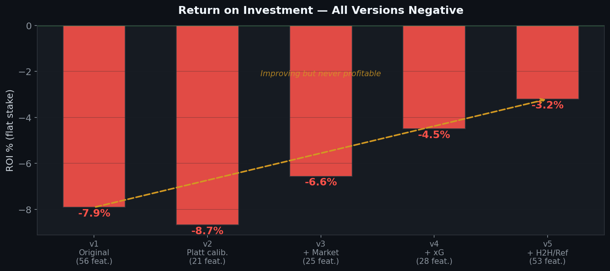

The improvement from v1 (−7.9%) to v5 (−3.2%) is mostly due to better calibration and smarter league selection — not because the model found a real edge. Restricting to E1 and F2 (the two leagues where the model's signal is most consistent) accounts for the final gain.

---

## Result 3 — The calibration paradox

The model is well-calibrated *globally* (left panel), but systematically overconfident *on the bets it selects* (right panel). This is the core issue.

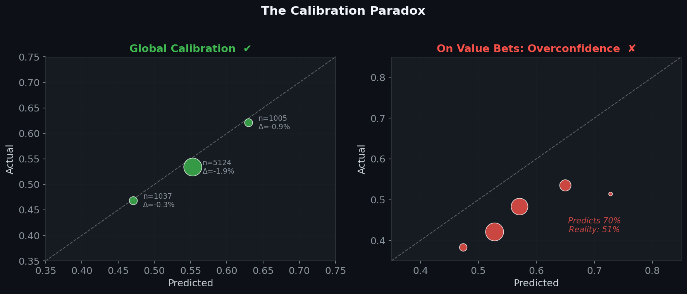

When the model predicts 55% probability and the bookie implies 48%, the *actual* frequency is ~48% — the bookie was right. The model's confidence comes from the noisy tail of its distribution, where it's least reliable.

---

## Result 4 — No monotonic edge

If a model has a genuine edge, higher-confidence bets should produce higher returns. Instead, ROI is flat negative regardless of the edge threshold — the signature of a model with no real predictive advantage.

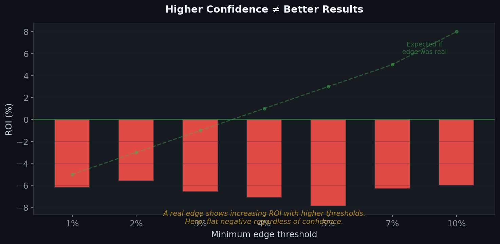

The green dashed line shows what we'd expect from a model with a real edge. The red bars show reality.

---

## Result 5 — Goals-based features dominate, market spread confirms the signal

In v5, `h_avg_goals_scored` ranks first and `odds_spread_under` (Max<2.5 / Avg<2.5) ranks second — confirming that both the statistical signal and the market's own uncertainty are informative, yet insufficient.

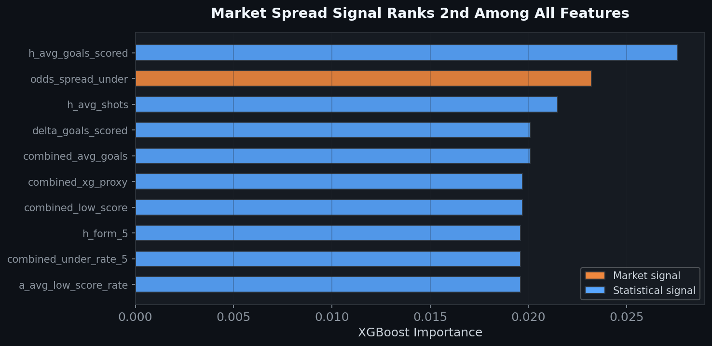

The odds spread measures how much sharp money has moved the under line relative to the average bookmaker. When this ratio is high, the market is signalling genuine uncertainty — a useful but not sufficient discriminator. All other top features are goal and shot-based rolling averages, consistent across all versions.

---

## Result 6 — No consistent league-level edge

Across the four Div2 leagues tested on the Under 2.5 market, only Ligue 2 shows a positive ROI (+1.4%) on 197 bets — statistically indistinguishable from noise (p-value > 0.5). Serie B (I2) and Segunda División (SP2) are strongly negative, dragging the overall result down. The final pipeline restricts betting to E1 and F2.

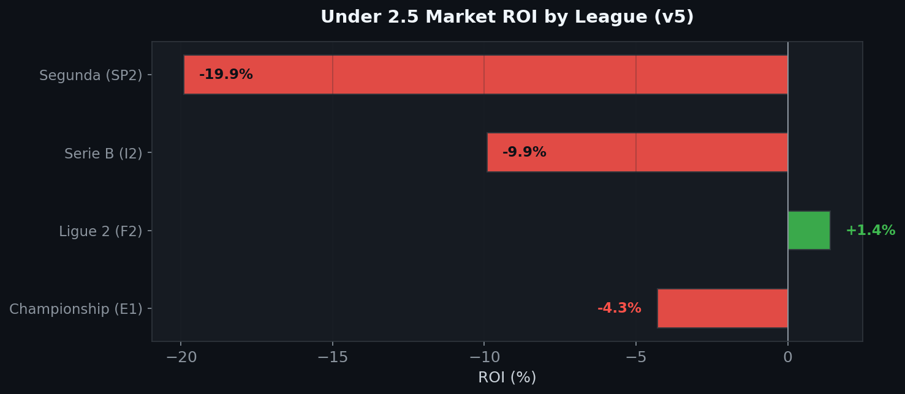

---

## Root Cause — Why v1 showed a false +3.8% ROI

The original model used **isotonic calibration** (`CalibratedClassifierCV(method='isotonic', cv='prefit')`) fitted on validation sets of ~300–500 matches. Isotonic calibration is non-parametric with as many parameters as unique predictions — it memorised the validation set's noise, creating systematic overconfidence that inflated the detected "edge."

Switching to **Platt calibration** (logistic sigmoid, only 2 parameters) eliminated the artefact and revealed the true ROI: **−8.7%**.

---

# The Edge That Does Exist — And It Isn't Machine Learning

The ML search failed, but the same dataset contains a profitable strategy that predicts nothing about football. **Anchor on the sharp price, bet the slow book**: take Pinnacle's odds as the market's best estimate, remove its margin with a *power* devig, and bet whenever some bookmaker in the panel prices an outcome above that fair value by more than 2%.

Across 1X2, Over/Under 2.5 and Asian Handicap, 2012–2024: **+4.86% ROI on 20 676 bets** (bootstrap 95% CI [+2.5, +7.2]), with **+3.05% CLV**. Implementation in [`src/value_bet_sharp.py`](src/value_bet_sharp.py).

### The bets behave exactly as a real edge should

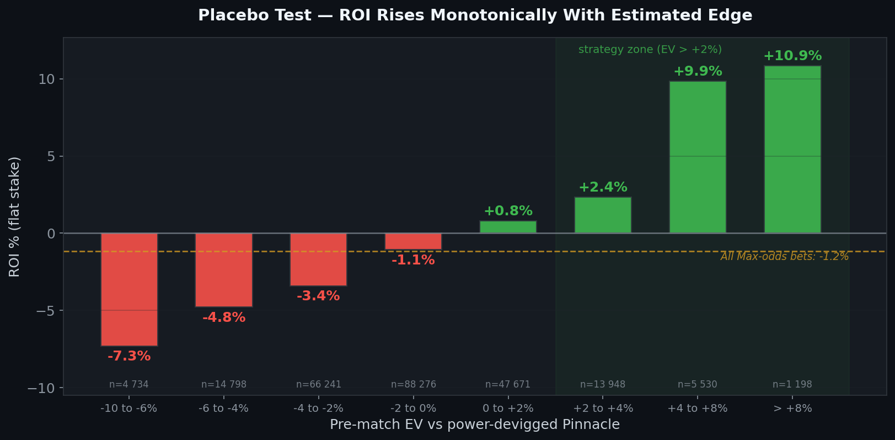

This is the strategy's own placebo test. Every Max-odds bet in the dataset, bucketed by the edge estimated *before* the match. Bets the model says are bad lose 7.3%; bets it says are good win 10.9%; the ordering never breaks. A backtest artefact would not produce a monotone gradient through zero — and note that betting Max odds indiscriminately loses 1.2%, so the premium of the best price alone explains none of this.

### No single league carries the result

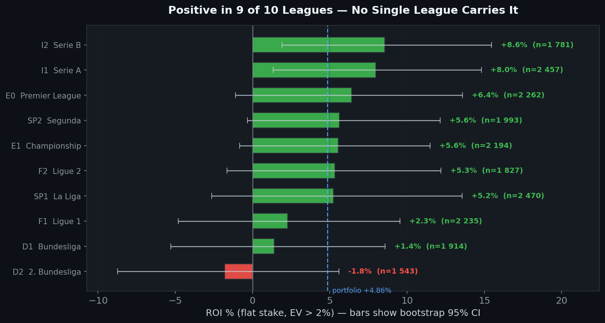

Nine of ten leagues are positive. Individual league CIs are wide — none of them is independently conclusive — but the result does not depend on any one of them: leave any league out and the rest still returns between +4.4% and +5.4%.

### Closing line value is the real evidence

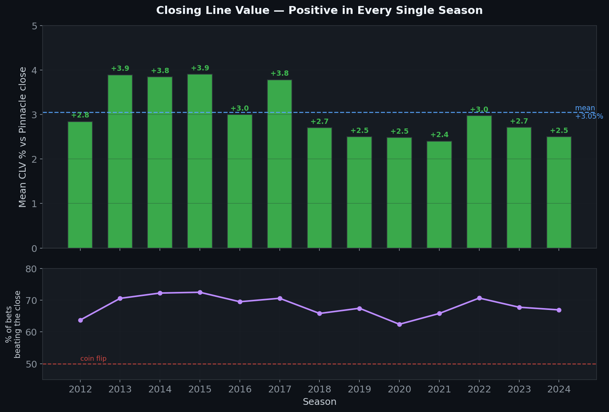

ROI is noisy; CLV is not. In all 13 seasons the selected bets were priced better than Pinnacle's own closing line, and roughly two thirds of individual bets beat the close. This is the standard proof that a selection captures genuine mispricing rather than variance — a coin flip sits at 50%.

### Equity curve

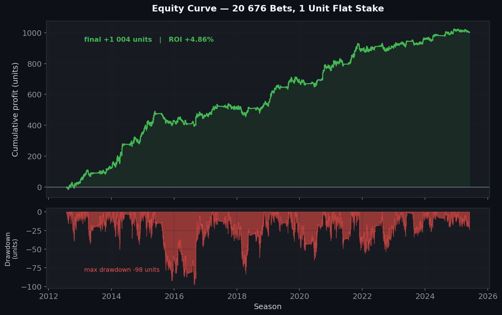

Flat 1-unit stakes, no compounding: +1 004 units over thirteen seasons, worst drawdown 98 units. The slope visibly flattens after 2022 — see below.

### The edge is line shopping, not stock picking

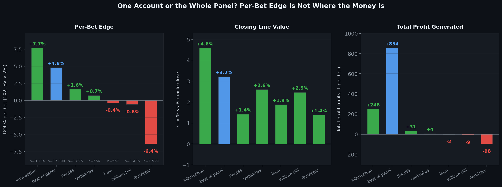

A counter-intuitive result worth stating plainly: the *best per-bet* returns come from Interwetten alone (+7.7%), not from the panel maximum (+4.8%). But per-bet edge is not where the money is — the panel finds 5.5× more opportunities and generates **854 units against 248**. One book also happens to be reliably *un*profitable to bet into (BetVictor, −6.4%). The edge lives in having somewhere to shop, not in one clever bookmaker.

### The window is closing

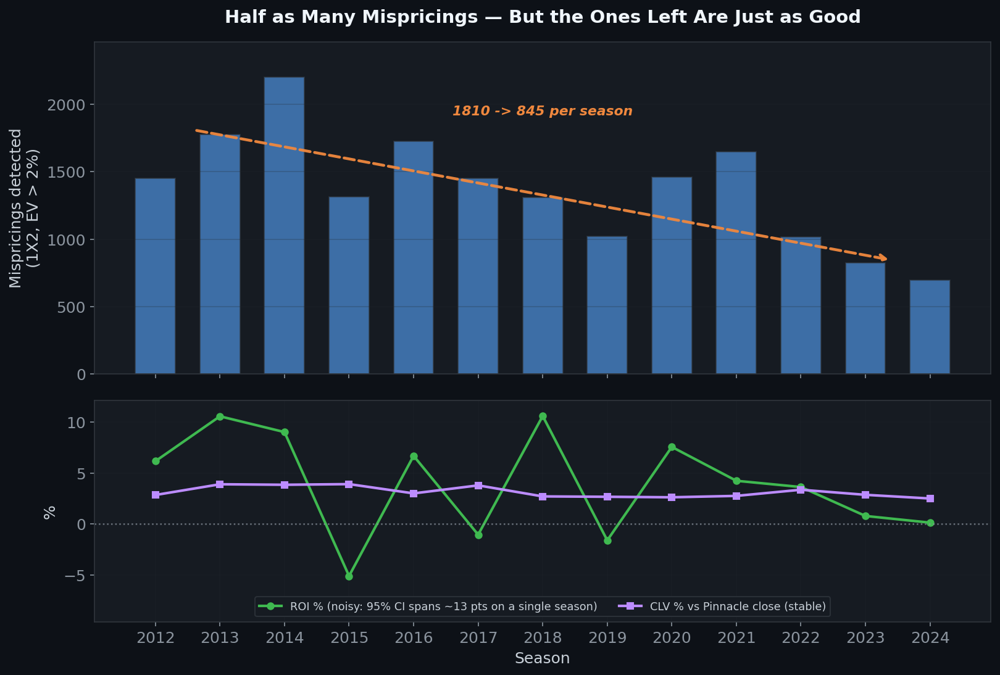

Restricted to 1X2, the only market covered across all thirteen seasons: qualifying mispricings have **halved**, from ~1 810 per season in 2012–2014 to ~845 in 2022–2024. ROI over 2022–2024 is +1.75% with a 95% CI of [−4.4, +8.1] — too wide to claim the edge has died, but no longer enough to claim it is intact either. CLV over the same span holds at +2.96% with 71% of bets beating the close, which suggests the selection still works and the opportunities are simply rarer.

### What this does and does not mean

The edge comes from soft bookmakers updating their prices more slowly than the sharp market, and it does not survive contact with a fast one: executed on Betfair Exchange, only 51% of bets beat the close — a coin flip — and realistic commission turns the return negative. The binding constraint is operational rather than statistical: soft books limit winning accounts within weeks, historical odds are snapshots rather than executable prices, and capturing the panel maximum assumes accounts almost everywhere. Full detail and every robustness test in [AUDIT.md](AUDIT.md).

---

## Methodology

### Walk-Forward Validation

```
Season N-k → N-2      Season N-1      Season N
┌────────────────┐   ┌────────────┐  ┌────────────┐
│     TRAIN       │   │    VAL     │  │    TEST    │
│  (fit model)    │   │ (calibrate)│  │  (evaluate) │
└────────────────┘   └────────────┘  └────────────┘
```

- Model retrained from scratch at each fold — no information leakage
- Calibration fitted on validation set only (never on test)
- Statistical significance: t-test + bootstrap 95% CI on every backtest

### Model

- **XGBoost** (conservative: `max_depth=4`, `min_child_weight=8`) with **Platt calibration** (sigmoid)
- Features: rolling team stats (goals, shots, under-rate, variance), dynamic league rankings, shot accuracy xG proxy, head-to-head under rate, fixture congestion (days rest), referee under-rate history, bookmaker odds spread (Max/Avg), no-vig bookmaker probabilities — 53 features total
- Edge = `P(model) − P(no-vig bookie)`

### Data

| Source | Coverage |
|--------|----------|
| [football-data.co.uk](https://www.football-data.co.uk) | 25 seasons × 10 leagues — match results, shots, cards, odds from 6+ bookmakers |
| [Understat](https://understat.com) | 8 seasons × 5 leagues — expected goals (xG) per match |

---

## What Would Actually Beat the Market

| Strategy | Why it works | Why we can't backtest it |
|----------|-------------|--------------------------|
| **Bet opening lines** | Lines move 2–5% before closing | football-data.co.uk only has closing odds |
| **React to team news** | Injuries shift true probability | No historical real-time news data |
| **Exotic markets** | Corners/cards/props have wider margins + less modelling effort from bookmakers | Not available in historical datasets |
| **Multi-sport volume** | 1–2% edge × 50,000 bets/year | Requires infrastructure, not ML research |

---

## Project Structure

```
value-bet-model/
├── src/
│   ├── download.py             # Auto-download from football-data.co.uk (25 seasons × 10 leagues)
│   ├── load.py                 # Data loading & cleaning
│   ├── features.py             # Feature engineering (rolling stats, H2H, congestion, referee, odds spread)
│   ├── model.py                # XGBoost + walk-forward + Platt calibration (53 features)
│   ├── backtest.py             # ROI simulation, significance tests, edge optimisation
│   ├── main.py                 # Under 2.5 pipeline (E1 + F2)
│   ├── draw_pipeline.py        # Draw pipeline (Div1)
│   ├── value_bet_sharp.py      # Sharp-anchor strategy (1X2 + O/U + AH), Kelly staking, paper trading
│   └── scrape_understat.py     # Selenium-based xG scraper
├── docs/
│   ├── generate_plots.py       # Regenerate the ML diagnostic plots (01–06)
│   ├── generate_sharp_plots.py # Regenerate the sharp-strategy plots (07–12)
│   └── *.png                   # AUC, ROI, calibration, EV gradient, CLV, equity, per-book, decay
├── LICENSE
├── requirements.txt
└── README.md
```

---

## Usage

```bash
pip install -r requirements.txt

# Download match data (25 seasons × 10 leagues)
python src/download.py --seasons 25

# Scrape xG data (requires Chrome + chromedriver)
python src/scrape_understat.py --seasons 2017 2025

# Run Under 2.5 pipeline
python src/main.py --edge 0.05

# Run Draw pipeline
python src/draw_pipeline.py --data-dir ./src/csv --edge 0.05

# Update current season only
python src/main.py --download --update

# Run the sharp-anchor strategy (the profitable one)
python src/value_bet_sharp.py --ev 0.02 --kelly

# Regenerate the strategy plots (07–12)
python src/value_bet_sharp.py --ev 0.02 --kelly --out src/value_bets_sharp.csv
python src/value_bet_sharp.py --ev -0.10 --out /tmp/all_ev.csv
python docs/generate_sharp_plots.py --all-ev /tmp/all_ev.csv
```

---

## Tech Stack

`Python` · `XGBoost` · `scikit-learn` · `Pandas` · `NumPy` · `Matplotlib` · `Selenium` · `SciPy`

---

**Marc'Andria Peri** — CPES 3A (Paris-Saclay × HEC × IP Paris), Data Science track

*Data: [football-data.co.uk](https://www.football-data.co.uk) · [Understat](https://understat.com)*
